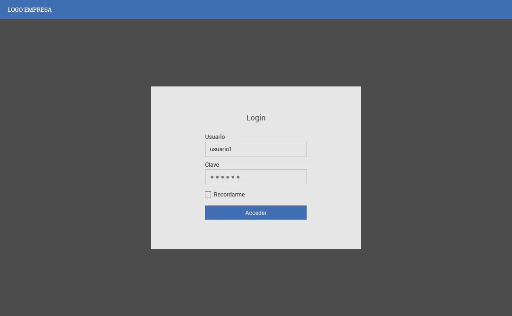
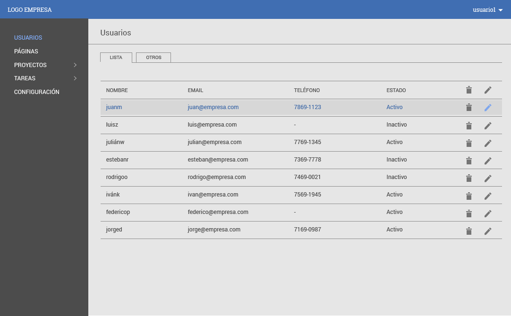
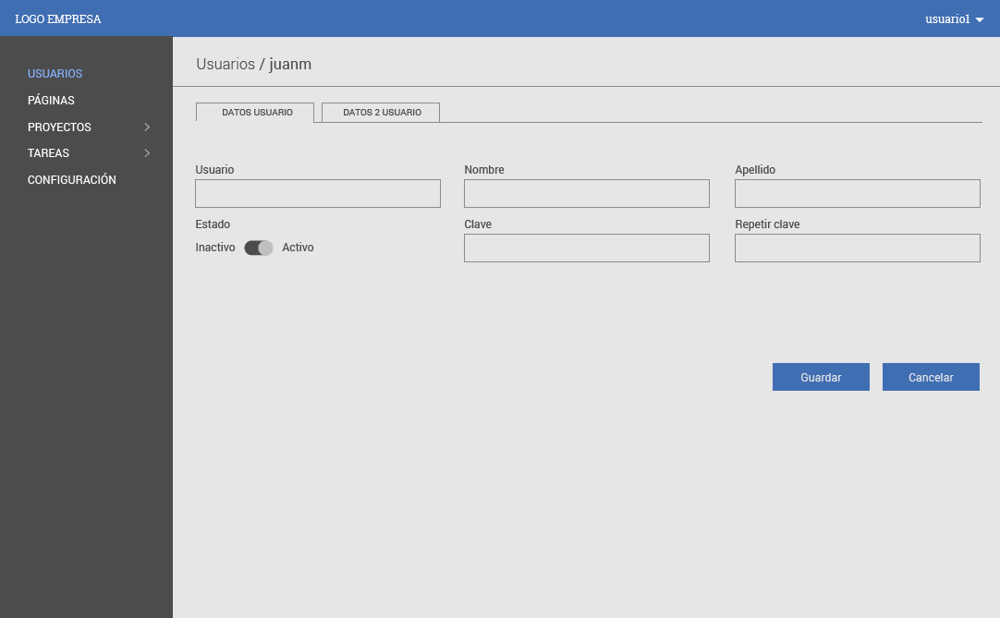
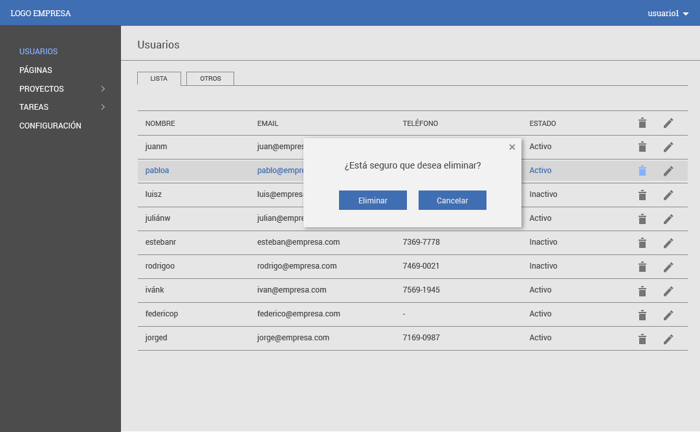

# Desarrollo software administración de usuarios


## Se requiere realizar un software con las siguientes características.
<span style="color:#fff; font-family: 'Bebas Neue'; font-size: 6em;">Realizar una aplicación con la capacidad de insertar, modificar, eliminar
y consultar (CRUD) registros sobre una API, dicha aplicación, debe contener un login para el ingreso a la misma.
Es necesario que almacene en Sessión Storage los datos del token en el navegador hasta que el usuario decida salir o cerrar el tab del navegador.
Se requiere que el desarrollo este completamente diseñado en reactJs utilizando
algunos de las siguientes librerias y patrones de desarollo.</span>


### Lenguajes y patrones de diseño que deben ser empleados para el desarrollo de la aplicación.
Para desarrollar esta aplicación es necesario seguir los siguientes patrones de
diseño con los estandares planteados y descritos paso a paso en la siguinte
documentación.


[Documentación de arquitectura](./microvoz/front_blank)


### Paso a paso del requerimiento

A continuación se enumera el paso a paso de que debe hacer el sotfware


| Paso| Nombre      | Descripción |   Detalle  	  |
| --- |-------------|-------------|:-------------:|
| 1 | Login | Al ingresar en la dirección del navegador **http://localhost:3000** debe mostrarse el login del software, si este cuenta con credenciales en el sistema lo debe redireccionar a la pantalla de inicio. |		|
| 2 | Login Error |Si los datos son incorrectos deberia mostrarse la siguiente pantalla. | 	|
| 3 | Pagina de Inicio |Ingresar usuario y contraseña y validar en el api dichos datos posteriormente el software debe redireccionar al usuario a la pantalla de usuarios del software desde donde podrá modificar, eliminar y consultar un registro  |	 |
| 4 | Paginación | La pantalla donde se listan los usuarios registados del sistema debe permitir paginar y filtrar los registros almacenados en la base de datos | 	|
| 5 | Creación nuevo usurio | Para crear un nuevo registro es necesario dirigirse al modulo de usuarios y dar click en el boton nuevo, posteriormente esto me llevara a una pantalla donde usuario procedera a crear el registro | 	|
| 6 | Guardar nuevo usurio | La creación del usuario debe validar que no exite previamente un registro con el mismo nombre en la base el api, adicionalmente los campos [nombre, email y apellido] son obligatorios | 	|
| 7 | Modificar usuario | Para modificar un registro es necesario dar click en el item de la tabla (grilla) de datos sebre el link que el usuario desea modificar | 	|
| 8 | Guardar usurio modificado | Para guardar los cambios de un registro es necesario dar click sobre el boton guardar cambios, y valigar que el email no exista, mostrando un texto por debajo del input que se esta validando o proceder a guardar cambios si los datos son correctos | 	|
| 9 | Eliminar usurio | Para eliminar un registro es necesario ubicarse en el item de la tabla de usuarios en el boton eliminar y proceder a dar click, posteriormente el software solicitara confirmación de la acción. | 	|
| 10 | Confirmar eliminación de usuario | Es necesario que el usuario confirme previamente si desea eliminar el registro con el mensaje **Desea eliminar el usuario Mauricio Andres Pineda** | 	|
| 11 | Logout | Para Salir de la plataforma es necesario dirigirse a la sessión **Perfil** dar click sobre el avatar del usuario y posteriormente click en logout, este debe de enviarlo a la sessión de login. | 	|


## Endpoints requeridos para el desarrollo

```
http://apiserver/api/oauth/token [POST]
http://apiServer/api/oauth/token [DELETE]
http://apiServer/api/users [GET]
http://apiServer/api/users [POST]
http://apiServer/api/users/1 [DELETE]
http://apiServer/api/users/1 [GET]
http://apiServer/api/users/1 [PUT]

```


### Tener en cuenta

- Es necesario que tanto los componentes como los contenedores deben estar
  documentados con una descripción corta y una descripción detallada sobre sus
  funciones

- El software debe estar escrito en ingles a nivel de codigo.


`mdless`

